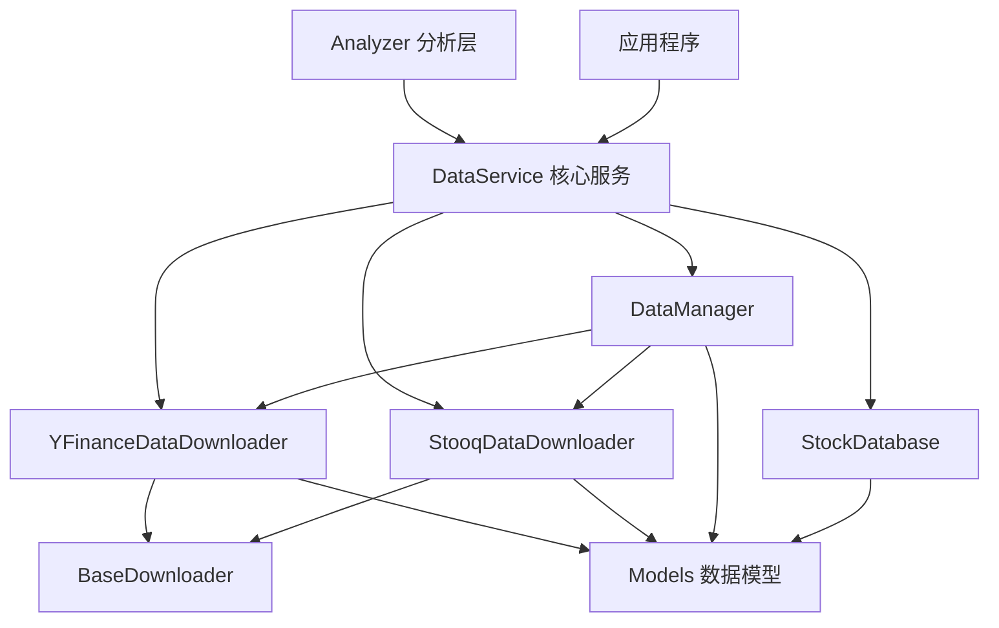

# 📊 数据服务层 (Data Service Layer)

数据服务层是股票分析系统的核心数据管理模块，负责数据获取、存储、处理和服务协调。

## 🚀 快速开始

### 推荐使用方式 - 便捷函数
```python
from data_service import create_data_manager

# 🎯 推荐：一行代码创建完整数据管理器
manager = create_data_manager("my_stocks.db")

# 智能下载（自动选择最佳策略）
result = manager.download_stock_data("AAPL")
print(f"使用策略: {result.get('used_strategy')}")

# 批量下载
symbols = ['AAPL', 'GOOGL', 'MSFT']
results = manager.batch_download(symbols)
```

### 传统使用方式
（已简化，建议直接使用上面的便捷函数或 DataManager）

## 📁 模块结构

```
data_service/
├── __init__.py                      # 📦 包初始化和便捷API
├── database.py                      # 💾 数据库操作层
├── data_service.py                  # 🏢 核心数据服务类
├── models.py                        # 📋 数据模型定义
├── downloaders/                     # 📥 下载器模块
│   ├── __init__.py                  # 下载器包初始化
│   ├── base.py                      # 🏗️ 下载器抽象基类
│   ├── yfinance.py                  # 📈 Yahoo Finance 数据下载器  
│   ├── stooq.py                     # 📊 Stooq 数据下载器
│   └── hybrid.py                    # 🔄 混合下载策略管理器（简化版，推荐名：DataManager）
└── README.md                        # 📄 本文件
```

## 🧩 核心组件功能

### 🏗️ `downloaders/base.py` - 下载器基础框架
**抽象基类，定义统一的下载器接口**
- `BaseDownloader`: 所有下载器的抽象基类
- 统一的重试机制和错误处理
- 标准化的日志记录
- 频率限制和退避策略

**核心方法:**
```python
def _retry_with_backoff(func, symbol)  # 带退避的重试机制
def _is_api_error_retryable(error)     # 判断错误是否可重试
```

### 📈 `downloaders/yfinance.py` - Yahoo Finance 下载器
**基于yfinance的主要数据下载器**
- `YFinanceDataDownloader`: 继承自BaseDownloader
- 支持股票价格和财务数据下载
- 返回结构化的DataClass对象
- 智能增量下载和数据验证

**主要功能:**
- 历史股票价格数据 (OHLCV)
- 实时股票数据
- 财务报表 (损益表、资产负债表、现金流)
- 公司基本信息和关键指标

### 📊 `downloaders/stooq.py` - Stooq 数据下载器  
**专用于大批量历史数据下载**
- `StooqDataDownloader`: 继承自BaseDownloader
- 优化的批量下载性能
- 长期历史数据获取
- 与yfinance形成互补

**主要功能:**
- 大批量历史数据下载
- 长期价格趋势数据
- 数据完整性验证
- 格式标准化处理

### 🔄 `downloaders/hybrid.py` - 数据管理器（简化）
**按是否新股选择数据源，并直接写库**
- `DataManager`: 新股走 Stooq 全量，老股走 yfinance 增量
- 内置简单策略与日志，便捷落地

### 💾 `database.py` - 数据持久化层
**统一的数据库访问接口**
- `StockDatabase`: 数据库操作封装
- 支持SQLite和PostgreSQL
- 事务管理和连接池
- 数据完整性约束

**核心功能:**
- 股票价格数据存储
- 财务数据存储  
- 综合数据存储
- 下载日志记录
- 数据查询和统计

### 📋 `models.py` - 数据模型层
**类型安全的数据结构定义**
- 使用Python DataClass
- 完整的类型注解
- 数据验证和序列化

**主要模型:**
```python
@dataclass
class PriceData:           # 价格数据
class StockData:           # 股票数据集合
class FinancialData:       # 财务数据
class ComprehensiveData:   # 综合数据
class DataQuality:         # 数据质量评估
class DownloadErrorInfo:   # 下载错误信息
```

### 🏢 `data_service.py` - 核心数据服务
**协调各组件的中央服务**
- `DataService`: 统一的数据服务接口
- 协调下载器和数据库
- 业务逻辑封装
- 批量操作支持

**核心方法:**
```python
def download_and_store_stock_data()           # 下载并存储股票数据
def download_and_store_comprehensive_data()   # 下载并存储综合数据  
def batch_download_and_store()                # 批量下载存储
def get_existing_symbols()                    # 获取已有股票列表
```

## 🔗 组件协作关系



## 📋 API 参考

### 🎯 推荐API

#### `create_data_manager(database_path, **config)` 
创建智能数据管理器，**推荐使用**
```python
from data_service import create_data_manager

# 基础使用
manager = create_data_manager("stocks.db")

# 自定义配置
manager = create_data_manager(
    database_path="stocks.db",
    max_retries=5,
    base_delay=30
)

# 智能下载
result = manager.download_stock_data("AAPL")
results = manager.batch_download(['AAPL', 'GOOGL', 'MSFT'])
```

（不再提供 `create_simple_downloader` API）

### 🔧 高级用法

#### 1. 数据管理器直接使用
```python
from data_service import DataManager, StockDatabase

# 手动创建和配置
database = StockDatabase("stocks.db")
manager = DataManager(database, max_retries=5)

# 下载单个股票（内部自动选择数据源）
result = manager.download_stock_data('AAPL')

# 简化版数据管理器当前不支持策略插拔配置
```

#### 2. 数据服务直接使用
```python
from data_service import DataService, StockDatabase, YFinanceDataDownloader

# 创建服务组件
database = StockDatabase("stocks.db")
downloader = YFinanceDataDownloader()
service = DataService(database, downloader)

# 批量下载和存储
symbols = ['AAPL', 'GOOGL', 'MSFT']
results = service.batch_download_and_store(
    symbols, 
    include_financial=True,
    incremental=True
)
```

#### 3. 直接使用下载器
```python
from data_service import YFinanceDataDownloader, StooqDataDownloader

# YFinance 下载器
yf_downloader = YFinanceDataDownloader(max_retries=3, base_delay=30)
stock_data = yf_downloader.download_stock_data("AAPL")
financial_data = yf_downloader.download_financial_data("AAPL")

# Stooq 下载器（适合大批量历史数据）
stooq_downloader = StooqDataDownloader()
historical_data = stooq_downloader.download_stock_data("AAPL", "2000-01-01")
```

#### 4. 数据模型使用
```python
from data_service import StockData, PriceData, DataQuality

# 创建价格数据
price_data = PriceData(
    dates=["2023-01-01", "2023-01-02"],
    open=[150.0, 152.0],
    high=[155.0, 154.0], 
    low=[149.0, 151.0],
    close=[152.0, 153.0],
    volume=[1000000, 1100000],
    adj_close=[152.0, 153.0]
)

# 数据序列化和反序列化
data_dict = price_data.to_dict()
restored_data = PriceData.from_dict(data_dict)
```

## 🎯 高级特性

（当前混合下载器为简化实现，暂不支持自定义策略插拔）

### 数据质量监控
```python
from data_service import DataService

service = DataService(database, downloader)

# 下载综合数据时自动评估质量
result = service.download_and_store_comprehensive_data("AAPL")
if result['success']:
    quality_grade = result['data_quality_grade']
    print(f"数据质量等级: {quality_grade}")
    
    comprehensive_data = result['comprehensive_data']
    issues = comprehensive_data.data_quality.issues
    if issues:
        print(f"数据质量问题: {issues}")
```

### 配置自定义
```python
# 配置混合下载器策略
config = {
    "strategies": [
        {"name": "yfinance", "enabled": True, "priority": 10},
        {"name": "stooq", "enabled": False, "priority": 20},
        {"name": "fallback", "enabled": True, "priority": 999}
    ]
}

# 简化版不支持策略配置
```

## 🛠️ 开发和扩展

### 添加新的数据源
1. 继承 `BaseDownloader`
2. 实现必要的抽象方法
3. 返回标准化的数据模型
4. 在 `DataManager` 中添加对应策略（当前简化实现，暂不支持策略插拔）

### 自定义数据模型
1. 在 `models.py` 中定义新的 DataClass
2. 实现 `to_dict()` 和 `from_dict()` 方法
3. 在相关下载器中使用新模型
4. 更新数据库存储逻辑

### 性能优化建议
- 使用 `batch_download_and_store()` 进行批量操作
- 启用增量下载减少数据传输
- 合理设置重试参数和延迟时间
- 使用数据库连接池提高并发性能

## 📊 监控和日志

### 下载日志
```python
# 查询下载日志
logs = database.get_download_logs(symbol="AAPL", limit=10)
for log in logs:
    print(f"{log['timestamp']}: {log['data_type']} - {log['status']}")
```

### 数据统计
```python
# 获取数据库统计信息
stats = database.get_database_stats()
print(f"总股票数: {stats['total_symbols']}")
print(f"总数据点: {stats['total_data_points']}")
print(f"最后更新: {stats['last_update']}")
```

## 🔧 配置参数

### YFinanceDataDownloader 配置
```python
downloader = YFinanceDataDownloader(
    max_retries=3,           # 最大重试次数
    base_delay=30           # 基础延迟时间（秒）
)
```

### DataManager 配置  
```python
manager = DataManager(
    database=database,
    max_retries=5,          # 最大重试次数
    base_delay=30           # 基础延迟时间
)
```

### DataService 配置
```python
service = DataService(
    database=database,
    stock_downloader=YFinanceDataDownloader(),    # 可选，默认创建新实例
    stooq_downloader=StooqDataDownloader()        # 可选，默认创建新实例  
)
```

## 🚦 最佳实践

### ⭐ 推荐使用模式

1. **🎯 首选便捷API**: 
   ```python
   # 推荐：简单直接
   manager = create_data_manager("stocks.db")
   
   # 而不是：手动组装
   database = StockDatabase("stocks.db")  
   manager = DataManager(database)
   ```

2. **📦 批量操作优先**: 
   ```python
   # 推荐：批量下载
   results = manager.batch_download(['AAPL', 'GOOGL', 'MSFT'])
   
   # 避免：逐个下载
   for symbol in symbols:
       manager.download_stock_data(symbol)
   ```

3. **🔧 配置传递**: 
   ```python
   # 推荐：通过create_data_manager传递配置
   manager = create_data_manager("stocks.db", max_retries=5, base_delay=60)
   ```

### 🛡️ 错误处理

```python
# 始终检查结果
result = manager.download_stock_data("AAPL")
if result.get('success'):
    print(f"成功，策略: {result['used_strategy']}")
else:
    print(f"失败: {result.get('error')}")
```

### ⚡ 性能优化

1. **启用增量下载**: 减少数据传输量
2. **合理设置重试参数**: 避免过度重试
3. **使用策略优先级**: 让系统选择最优数据源
4. **及时关闭资源**: `manager.close()` 释放数据库连接

### 🔍 监控数据质量

```python
# 使用综合下载获取质量评估
result = service.download_and_store_comprehensive_data("AAPL") 
if result.get('comprehensive_data'):
    quality = result['comprehensive_data'].data_quality
    print(f"数据质量: {quality.quality_grade}")
    if quality.issues:
        print(f"问题: {quality.issues}")
```

## 📈 输出和存储

### 数据库表结构
- `stock_prices`: 股票价格数据
- `financial_data`: 财务数据  
- `comprehensive_data`: 综合数据
- `download_logs`: 下载日志
- `data_quality`: 数据质量记录

### 数据格式
所有数据都以标准化的 DataClass 格式存储，确保:
- 类型安全
- 数据一致性
- 易于序列化和反序列化
 

## 🆕 最新更新

### v2.0 重大更新（校正）
- ✨ **新增便捷API**: `create_data_manager()`
- 🏗️ **重构包结构**: 更清晰的模块组织（本文档已对齐实际文件名）
- 🎯 **推荐使用方式**: 一行代码创建完整数据管理器
- 📋 **完整导出**: `__all__` 列表包含所有可用API

---

这个数据服务层为整个股票分析系统提供了坚实的数据基础，通过模块化设计和策略化选择数据源实现高灵活性。便捷API使使用更加简单直观，同时保持完整的功能和配置灵活性。
